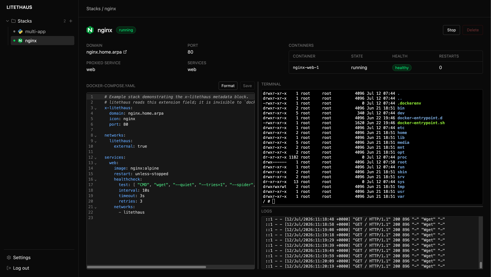

# LITEHAUS

A stateless, database-free, all-in-one homelab dashboard, docker-compose manager, and automated reverse proxy.

litethaus scans a directory of docker-compose stacks, gives you a dashboard to start/stop them and watch their logs in real time, and can optionally wire up [Caddy](https://caddyserver.com/) as a reverse proxy for whichever ones you expose — no labels in your compose files, no database, no separate proxy config to maintain by hand. If you already run your own reverse proxy, Caddy management can be turned off entirely.



## Features

- **Stack discovery** — scans a directory for one subfolder per stack, each with its own `compose.yaml` (or `compose.yml` / `docker-compose.yaml` / `docker-compose.yml`), plus an optional override file (see below)
- **Start/stop/logs** — control stacks and stream their logs live from the browser
- **Stack authoring** — create, edit, and delete stacks from the UI via a raw compose YAML editor, edited inline on the stack page; a stack with multiple containers or multiple compose files gets tabs for each
- **In-browser terminal** — a real shell into any of a stack's running containers, next to its compose editor and live logs
- **Automatic reverse proxy** — add an `x-litethaus:` block to a stack's compose file with a domain and port, and litethaus wires it into Caddy automatically
- **Automatic HTTPS** — self-signed certs via Caddy's local CA (for `.home.arpa`/`.local` domains) or real ACME/Let's Encrypt certs for publicly resolvable domains
- **Health monitoring** — per-container health and restart-loop status in the dashboard, with an optional webhook alert
- **Single-user login** — a simple password gate for the dashboard itself
- **Light/dark/system theme**, responsive layout

## How it works

- The host file system is the source of truth — there's no database. Litethaus just reads and writes the compose files already in your stacks directory.
- Per-stack metadata (domain, port, icon) lives in each stack's own compose file, in a root-level `x-litethaus:` extension field — invisible to `docker compose` itself, but read by litethaus.
- Global settings (which directory to scan, HTTPS mode, theme, etc.) live in a single `config.yaml`, edited either directly or through the Settings page.
- The reverse proxy is a bundled Caddy instance, configured entirely through Caddy's native admin API — litethaus never touches your services' compose files to add proxy labels. It's optional: turn `caddy_enabled` off in Settings if you front stacks with your own reverse proxy instead.

## Getting started

Requires Docker and Docker Compose.

```bash
git clone <this repo>
cd litethaus
docker compose -f docker-compose.dev.yaml up --build
```

This starts the dashboard without the bundled Caddy proxy — handy if you already run your own reverse proxy in front of your stacks. To also run Caddy, add `--profile caddy`:

```bash
docker compose -f docker-compose.dev.yaml --profile caddy up --build
```

Then open `http://localhost:5173`. On first run you'll be asked to set up an admin username and password. Once you're in, go to **Settings** and point `Stacks directory` at wherever your own compose stacks live (a bind mount, in the containerized setup above).

## Configuration

Global settings live in `config.yaml`, generated automatically with defaults on first run (also editable from the Settings page). It holds instance-specific state including the admin password hash, so it's gitignored rather than tracked — there's nothing to seed or copy manually:

| Key | Description |
|---|---|
| `auth_enabled` | Whether the single-user login gate is enforced; set to `false` to disable auth entirely (local testing only — leaves every endpoint open) |
| `stacks_dir` | Directory containing one subfolder per stack |
| `caddy_enabled` | Whether litethaus manages the bundled Caddy reverse proxy; set to `false` if you front stacks with your own reverse proxy instead |
| `caddy_admin_url` | Base URL for Caddy's admin API |
| `https_mode` | `off`, `internal` (self-signed), or `acme` (Let's Encrypt) |
| `acme_email` | Registration email, required when `https_mode` is `acme` |
| `cloudflare_api_token` | Cloudflare API token for DNS-01 ACME challenges (Zone:Read + DNS:Edit); enables wildcard certs; leave blank for HTTP-01/TLS-ALPN-01 |
| `wildcard_domain` | Issue one wildcard cert (`*.<domain>`) covering every stack instead of a cert per stack domain; requires `cloudflare_api_token`; leave blank for per-stack certs |
| `theme` | `light`, `dark`, or `system` |
| `webhook_url` | Optional webhook POSTed to when a stack becomes unhealthy or restart-loops |

Per-stack settings live in each stack's compose file under `x-litethaus:`:

```yaml
x-litethaus:
  domain: myapp.home.arpa
  port: 8080
  service: web    # optional: which service to proxy to, if there's more than one
  icon: nginx     # optional: slug from https://github.com/homarr-labs/dashboard-icons
```

A stack directory can also hold an override file — `compose.override.yaml`/`.yml` next to `compose.yaml`/`.yml`, or `docker-compose.override.yaml`/`.yml` next to `docker-compose.yaml`/`.yml` — which litethaus auto-merges in via a second `-f` whenever the stack starts, same as `docker compose` does by default. Any other compose-named file in the directory (e.g. a leftover from switching naming conventions) is just exposed as an extra editor tab and otherwise ignored.

## Development

- **Backend:** `cd backend && python3 -m venv .venv && source .venv/bin/activate && pip install -r requirements.txt && uvicorn main:app --reload`
- **Frontend:** `cd frontend && npm install && npm run dev`
- **Full stack:** `docker compose -f docker-compose.dev.yaml up --build`
